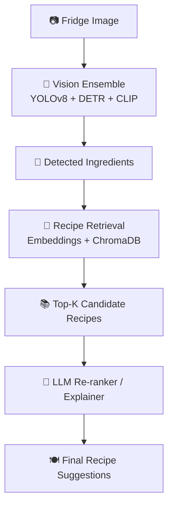
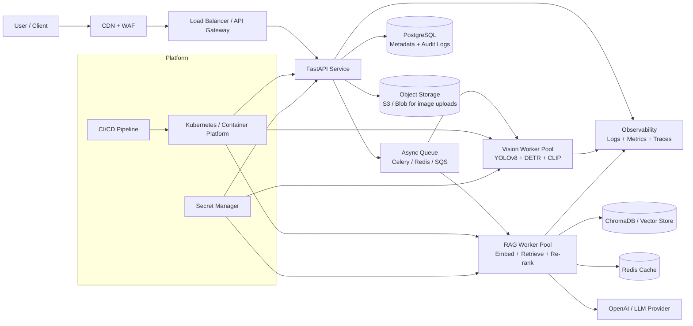

# 🧊🍳 FRIDGE-RAG

<p align="center">
  <b>Turn a fridge photo into practical recipe ideas with multimodal AI + Retrieval-Augmented Generation (RAG).</b>
</p>

<p align="center">
  
  
  
  
</p>

> ✨ **Pipeline at a glance:** Upload fridge image → detect ingredients → retrieve relevant recipes → generate explainable cooking suggestions.

---

## 📚 Table of Contents

- [🔎 Overview](#-overview)
- [🚀 Core Capabilities](#-core-capabilities)
- [🧠 System Architecture](#-system-architecture)
- [🏗️ Production-Grade Architecture](#️-production-grade-architecture)
- [🗂️ Project Structure](#️-project-structure)
- [🛠️ Tech Stack](#️-tech-stack)
- [⚡ Quick Start](#-quick-start)
  - [Prerequisites](#prerequisites)
  - [Installation](#installation)
  - [Environment Variables](#environment-variables)
  - [Dataset Setup](#dataset-setup)
  - [Build the Vector Database](#build-the-vector-database)
- [▶️ Run the Application](#️-run-the-application)
- [🧪 Testing](#-testing)
- [📁 Why the `data/` folder is not on GitHub](#-why-the-data-folder-is-not-on-github)
- [🧭 Operational Guidance](#-operational-guidance)
- [🆘 Troubleshooting](#-troubleshooting)
- [🗺️ Roadmap](#️-roadmap)

---

## 🔎 Overview

FRIDGE-RAG combines:

1. 👁️ **Vision models** (YOLOv8 + DETR + CLIP) to infer ingredients from fridge images.
2. 🧾 **Semantic retrieval** (SentenceTransformer embeddings + ChromaDB) to fetch matching recipes.
3. 🤖 **LLM reasoning** (OpenAI GPT models) to rank, explain, and personalize recommendations.

This repository provides a clean, production-oriented scaffold with API, dashboard, scripts, and test structure ready for implementation and scaling.

---

## 🚀 Core Capabilities

- 📷 **Image-to-ingredient extraction** from fridge snapshots.
- 🧠 **RAG-based retrieval** over a large recipe dataset.
- 🥗 **Context-aware suggestions** using detected fridge contents.
- ⚡ **FastAPI backend** for orchestration and serving.
- 📊 **Streamlit dashboard** for demos and interactive prototyping.

---

## 🧠 System Architecture

A simplified end-to-end flow of how FRIDGE-RAG works at inference time:



> This is the **functional pipeline view**. For deployable infra components (queue, cache, gateway, workers, observability), see the Production-Grade Architecture section below.

---

## 🏗️ Production-Grade Architecture

For real-world deployment, run FRIDGE-RAG as loosely coupled services with clear boundaries for **security, scalability, and observability**.



### Recommended Production Controls

- 🔐 **Security:** WAF, request size limits, signed URL uploads, secret manager integration, and least-privilege service accounts.
- 📈 **Scalability:** Independent autoscaling for API, vision workers, and RAG workers; queue-backed async jobs for heavy image processing.
- ⚡ **Performance:** Redis caching for embeddings/hot recipe queries, batched inference, and precomputed index shards.
- 🧪 **Reliability:** Health checks, readiness/liveness probes, retry policies with dead-letter queues, and versioned model rollouts.
- 📊 **Observability:** Centralized logs, Prometheus-style metrics, distributed tracing, and SLO-driven alerting.

---

## 🗂️ Project Structure

```bash
FRIDGE-RAG/
├── api/                  # FastAPI app and request/response schemas
├── dashboard/            # Streamlit dashboard
├── scripts/              # Data download + vector DB build scripts
├── src/                  # Core pipeline/config modules
├── tests/                # Unit/integration test suite
├── data/                 # Local-only generated/downloaded assets (git-ignored)
├── .env.example          # Environment variable template
├── requirements.txt      # Python dependencies
└── README.md
```

---

## 🛠️ Tech Stack

- **Vision:** YOLOv8, DETR, CLIP (open-clip)
- **Embeddings:** `sentence-transformers` (`all-MiniLM-L6-v2`)
- **Vector Database:** ChromaDB
- **LLM:** OpenAI API (e.g., GPT-4o-mini)
- **Backend:** FastAPI + Uvicorn
- **Frontend:** Streamlit (+ Plotly for visualization)
- **Dataset:** Food.com Recipes and Reviews (Kaggle)

🔗 Dataset source: https://www.kaggle.com/datasets/irkaal/foodcom-recipes-and-reviews/data

---

## ⚡ Quick Start

### Prerequisites

- Python **3.10+**
- `pip` + virtual environment tooling
- Kaggle API credentials (`~/.kaggle/kaggle.json`)
- OpenAI API key

### Installation

```bash
# 1) Clone repository
git clone <your-repo-url>
cd FRIDGE-RAG

# 2) Create and activate a virtual environment
python -m venv .venv
source .venv/bin/activate   # Windows: .venv\Scripts\activate

# 3) Install dependencies
pip install -r requirements.txt
```

### Environment Variables

```bash
cp .env.example .env
```

Update `.env`:

```env
OPENAI_API_KEY=your_real_openai_key
```

### Dataset Setup

1. Create a Kaggle API token at: https://www.kaggle.com/settings
2. Place the token file:

```bash
mkdir -p ~/.kaggle
echo '{"username":"YOUR_KAGGLE_USERNAME","key":"YOUR_KAGGLE_KEY"}' > ~/.kaggle/kaggle.json
chmod 600 ~/.kaggle/kaggle.json
```

### Build the Vector Database

```bash
python scripts/build_vectordb.py
```

> ⏱️ First indexing run can take several minutes depending on dataset size and machine resources.

---

## ▶️ Run the Application

### Start API

```bash
uvicorn api.main:app --host 0.0.0.0 --port 8000 --reload
```

### Start Dashboard

In another terminal:

```bash
streamlit run dashboard/app.py
```

---

## 🧪 Testing

```bash
pytest tests/ -v
```

Useful variants:

```bash
pytest tests/test_pipeline.py -v
pytest -q
```

---

## 📁 Why the `data/` folder is not on GitHub

Short answer: **it is intentionally git-ignored.**

- In this project, generated/downloaded assets under `data/raw/` and `data/recipe_db/` are excluded in `.gitignore`.
- GitHub only shows tracked files; ignored local folders are not pushed, so they do not appear in the remote repository.
- Your coding editor (VS Code, Cursor, PyCharm, etc.) shows files/folders that exist on disk locally, whether tracked by Git or not.

✅ So it is normal that:
- You can see `data/` locally after running setup scripts.
- You do **not** see `data/` on GitHub.

This keeps the repository lightweight and avoids committing large, reproducible data artifacts.

---

## 🧭 Operational Guidance

For production readiness, consider:

- 📦 **Model lifecycle:** pin and version model artifacts.
- 📐 **Data contracts:** enforce strict API schemas.
- 📈 **Observability:** add structured logs, traces, and metrics.
- ⚡ **Caching:** cache embeddings and frequent retrievals.
- 🛡️ **Guardrails:** validate image inputs and sanitize user text.
- 🚢 **Deployment:** containerize API/dashboard and add reverse proxy.
- 🔐 **Security:** store secrets in a vault or secret manager.

---

## 🆘 Troubleshooting

- **Kaggle download fails**
  - Ensure `~/.kaggle/kaggle.json` exists with `chmod 600` permissions.

- **OpenAI auth errors (`401`)**
  - Verify `OPENAI_API_KEY` is set in `.env`.

- **Slow indexing/retrieval**
  - Rebuild vector DB on SSD and/or reduce local dataset size.

- **Torch/vision installation issues**
  - Match Torch install to your CPU/CUDA environment.

---

## 🗺️ Roadmap

- [ ] Calibrate ingredient confidence across ensemble models.
- [ ] Add recipe filtering by dietary constraints/allergens.
- [ ] Add evaluation harness for retrieval precision/recall.
- [ ] Add Docker + CI/CD pipeline.
- [ ] Add end-to-end integration tests and benchmark suite.
