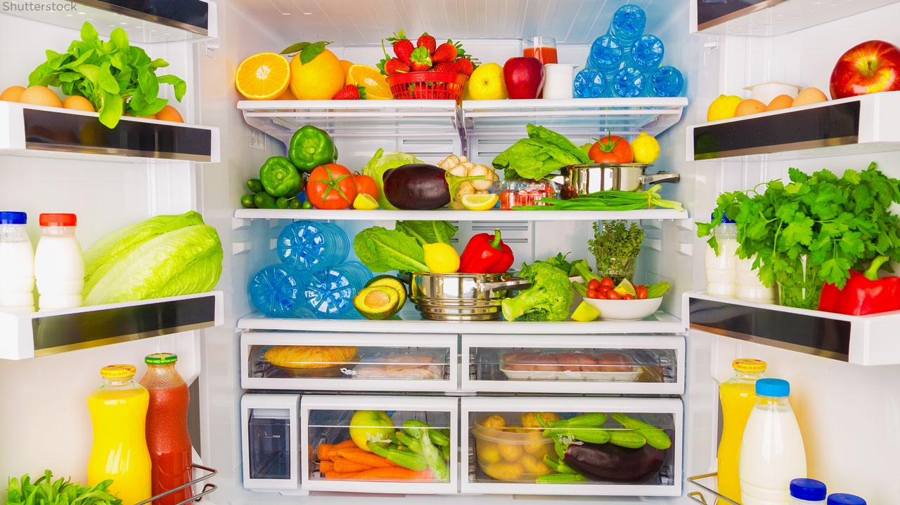
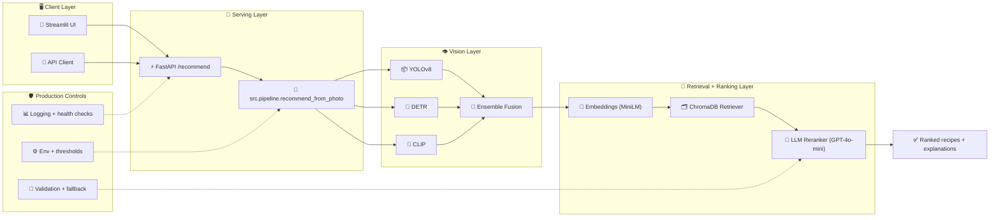
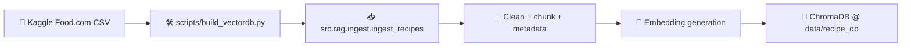

# 🧊🍳 DishSense

**Fridge photo in → ranked, explainable recipes out.**

DishSense is a FRIDGE-RAG multimodal system that combines:
- **Computer Vision** (YOLOv8 + DETR + CLIP) to detect ingredients from a fridge photo.
- **RAG retrieval** (Sentence-Transformers + ChromaDB) to fetch relevant recipes.
- **LLM reranking** (OpenAI GPT-4o-mini + Local-LLM Reranker) to produce explainable final recommendations.
- **FastAPI + Streamlit** for API-first serving plus a demo UI.

---

<p align="left">
  
  
  
  
</p>

## 🔄 Latest updates snapshot

To keep this README aligned with today's added/modified files and commits:
- Added `src/evaluation.py`, a retrieval/ranking evaluation harness for **P@K, Recall@K, and nDCG@K**.
- Updated `src/config.py` and `.env.example` with clearer compute/reranker configuration, including documented offline/local reranker usage.
- Enhanced `src/rag/reranker.py` and `src/rag/ingest.py` behavior for stronger ranking/ingestion robustness.
- Updated `dashboard/app.py` integration details to align with the latest API request flow.
- Removed `docs/images/workflow-overview.svg` as part of deleting the `docs/images` directory.

## 📸 Project image context

Sample fridge image used for end-to-end testing:





## Why this project is useful

Most demos stop at “object detection.” This project is built like a small production prototype:
- Ensemble detection for stronger ingredient coverage.
- Semantic retrieval with optional calorie/time filters.
- Human-readable ranking reasons + missing ingredients.
- Clear module boundaries (API, pipeline, vision, retrieval, UI, tests).

---

## 🧭 End-to-end architecture

### 🟢 Online inference flow (production-style)



### 🟣 Offline indexing flow (data pipeline)



---

## Repository map (all tracked files)

```text
FRIDGE-RAG/
├── README.md
├── requirements.txt
├── .env.example
├── Sample-image.jpg
├── api/
│   ├── __init__.py
│   ├── main.py                 # FastAPI app (/health, /recommend)
│   └── schemas.py              # Pydantic response models
├── dashboard/
│   ├── __init__.py
│   └── app.py                  # Streamlit UI client for API
├── scripts/
│   └── build_vectordb.py       # CLI wrapper to ingest recipe CSV into Chroma
├── src/
│   ├── __init__.py
│   ├── config.py               # global constants (models, thresholds, paths)
│   ├── pipeline.py             # online orchestration entrypoint
│   ├── evaluation.py           # retrieval/ranking metrics harness (P@K, Recall@K, nDCG)
│   ├── rag/
│   │   ├── __init__.py
│   │   ├── ingest.py           # CSV parsing + embedding + Chroma upsert
│   │   ├── retriever.py        # semantic query + metadata filters
│   │   └── reranker.py         # OpenAI LLM reranking + enrichment
│   └── vision/
│       ├── __init__.py
│       ├── yolo_detector.py    # YOLO detector wrapper
│       ├── detr_detector.py    # DETR detector wrapper
│       ├── clip_detector.py    # CLIP zero-shot detector wrapper
│       └── ensemble.py         # confidence fusion + dedupe
└── tests/
    ├── __init__.py
    ├── test_pipeline.py        # pipeline behavior with mocks
    ├── test_vision.py          # ensemble logic tests
    └── test_rag.py             # retriever behavior tests
```

---

## 🧱 Core components

### 1) 👁️ Vision detection (`src/vision/*`)
- **YOLOv8**: fast baseline detector.
- **DETR**: transformer detector, useful for different detection bias.
- **CLIP**: zero-shot ingredient matching over candidate vocabulary.
- **Ensemble fusion**:
  - normalize labels,
  - average confidence,
  - apply multi-model boost,
  - threshold and rank.

### 2) 🔎 Retrieval (`src/rag/retriever.py`)
- Embeds ingredient query with `all-MiniLM-L6-v2`.
- Runs vector query in ChromaDB.
- Supports metadata filters:
  - `max_calories`
  - `max_minutes`

### 3) 🤖 LLM reranking (`src/rag/reranker.py`)
- Sends candidate summaries + user preferences to OpenAI.
- Returns JSON-ranked recipes with:
  - `coverage_pct`
  - `missing_ingredients`
  - `nutrition_score`
  - `reason`
- Fallback: similarity-order if JSON parse fails.

### 4) ⚡ API (`api/main.py`)
- `GET /health`: model/db health summary.
- `POST /recommend`: image + optional constraints to recipe recommendations.

### 5) 🖥️ Dashboard (`dashboard/app.py`)
- Upload image + sliders for filters.
- Displays ingredient list and expandable recommendation cards.

---

## 🛠️ Setup

## 1) 📋 Prerequisites
- Python **3.10+**
- Kaggle API credentials (for dataset download)
- OpenAI API key

## 2) 📦 Install dependencies

```bash
git clone <your-repo-url>
cd FRIDGE-RAG
python -m venv .venv
source .venv/bin/activate
pip install -r requirements.txt
```

## 3) ⚙️ Configure environment

```bash
cp .env.example .env
```

Set key in `.env`:

```env
OPENAI_API_KEY=your_key_here
```

## 4) 🔐 Configure Kaggle credentials

```bash
mkdir -p ~/.kaggle
echo '{"username":"YOUR_KAGGLE_USERNAME","key":"YOUR_KAGGLE_KEY"}' > ~/.kaggle/kaggle.json
chmod 600 ~/.kaggle/kaggle.json
```

## 5) 🧬 Build the vector DB

```bash
python scripts/build_vectordb.py
```

Useful options:

```bash
python scripts/build_vectordb.py --help
python scripts/build_vectordb.py --limit 10000
python scripts/build_vectordb.py --batch-size 64
```

---

## ▶️ Run locally

### ⚡ Start API
```bash
uvicorn api.main:app --host 0.0.0.0 --port 8000 --reload
```

### 🖥️ Start dashboard
```bash
streamlit run dashboard/app.py
```

### ❤️ Quick health check
```bash
curl http://localhost:8000/health
```

---

## API reference

### `GET /health`

**Response fields**:
- `status`
- `models_loaded`
- `db_ready`
- `recipe_count`

### `POST /recommend`

**Multipart form fields**:
- `photo` (required): jpeg/png/webp
- `preferences` (optional text)
- `max_calories` (optional int; 0 = no limit)
- `max_minutes` (optional int; 0 = no limit)
- `top_n` (1-10)

**Example curl**:

```bash
curl -X POST http://localhost:8000/recommend \
  -F "photo=@Sample-image.jpg" \
  -F "preferences=high protein, low carb" \
  -F "max_calories=600" \
  -F "max_minutes=30" \
  -F "top_n=5"
```


---

## Testing

Run all tests:

```bash
pytest tests/ -v
```

Targeted runs:

```bash
pytest tests/test_vision.py -v
pytest tests/test_rag.py -v
pytest tests/test_pipeline.py -v
```

---

## Common enhancements to add next

1. **Caching layer (CAG-style memory/cache)** for recurring user sessions.
2. **Expand the evaluation harness** with dataset slices, baselines, and automated reports.
3. **Observability**: tracing spans for detection/retrieval/rerank latency.
4. **Containerization**: Docker + Compose for one-command local startup.
5. **Allergen & diet taxonomy filters** beyond free-text preference string.
6. **CI pipeline** with lint/test checks and model-mocking for speed.
7. **MLflow integration** with experiment tracking/test checks and model-versioning for maintainability.

---

## Notes on local `data/.`

`data/` is generated locally during ingestion and is usually gitignored.
That keeps the repository small and avoids committing generated vector DB artifacts.

---

## License and contribution

If you open PRs, include:
- motivation,
- expected quality/runtime impact,
- testing evidence.

Contributions are welcome.

---

## ✅ README compatibility note

This revamp intentionally **preserves all existing README content** and adds an update layer for recent commits, plus contextual images where applicable.
